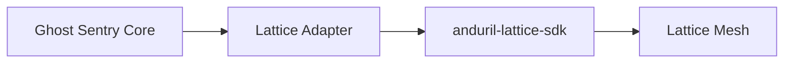

# Lattice Integration Strategy

Ghost Sentry is "Lattice-native" by design. It mirrors the Lattice Data Schema internally and facilitates seamless two-way communication with the Lattice Mesh.

## Integration Diagram



## Data Models

Ghost Sentry utilizes Pydantic models that align 1:1 with Lattice Protobuf definitions.

### Tracks
A **Track** represents a persistent object in the world.
- **Example**: A detected airplane.
- **Mapping**: `TEMPLATE_TRACK` with `Platform: Airplane`.

### Tasks
A **Task** represents a request for a platform to perform an action.
- **Example**: "Verify this location."
- **Mapping**: `VERIFICATION_REQUEST`.

## The Adapter Pattern

To ensure robustness and ease of testing, we employ the Adapter Pattern.

<CodeGroup>
```python Adapter Interface
class LatticeConnector:
    def publish_track(self, track: LatticeTrack):
        ...
    def publish_task(self, task: LatticeTask):
        ...
```
</CodeGroup>

### Operation Modes

1.  **Dev Mode**: Events are written to a local JSONL file (`lattice_events.jsonl`). This allows developers to build and test logic without a running Lattice instance.
2.  **Prod Mode**: Events are sent via gRPC to the Lattice Ingestion Service.

## Entity Mapping

| YOLO Class | Lattice Ontology | milView Disposition |
| :--- | :--- | :--- |
| **airplane** | `TEMPLATE_TRACK` (Platform: Airplane) | `UNKNOWN` |
| **truck** | `TEMPLATE_TRACK` (Platform: Vehicle) | `UNKNOWN` |
| **boat** | `TEMPLATE_TRACK` (Platform: Vessel) | `UNKNOWN` |

## Autonomous Tasking Loop

The core value proposition of Ghost Sentry is the autonomous loop:

1.  **Detect**: High-confidence object found.
2.  **Evaluate**: Is this a priority target? (e.g., Tank vs. Car)
3.  **Task**: If priority, generate a `VERIFICATION_REQUEST` at the object's geolocation.
4.  **Publish**: Send task to Lattice Mesh for distribution to available assets (drones, cameras).
