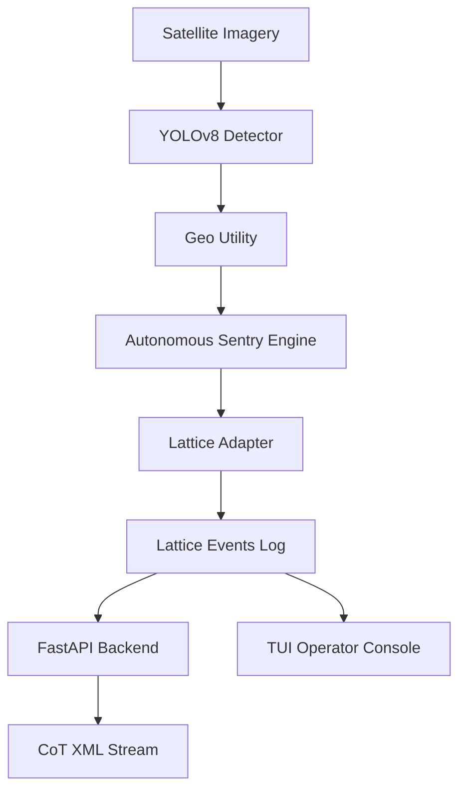

# Architecture

Ghost Sentry is designed as a modular, container-ready application composed of distinct processing stages.

## Component Diagram

## Core Components

### 1. Detection Engine
The eyes of the system.
- **Model**: YOLOv8n (Nano) fine-tuned on tactical targets.
- **Classes**: Airplane, Truck, Car, Boat, Bus.
- **Performance**: < 100ms inference on standard CPUs.

### 2. Geospatial Utility
The navigation system.
- Converts pixel coordinates from satellite imagery to WGS84 Latitude/Longitude.
- Uses `Rasterio` and `Shapely` for precise geolocation.
- Handles mocked geolocation injection for demonstration datasets.

### 3. Autonomous Sentry Engine
The brain of the system.
- **Decision Logic**: Evaluates detections against priority thresholds.
- **Trigger**: Confidence > 0.85 for high-priority targets triggers a cue.
- **Action**: Generates a `VERIFICATION_REQUEST` Task Entity.

### 4. Lattice Adapter
The communication layer.
- Implements the Adapter Pattern to decouple core logic from the specific Lattice SDK version.
- **Modes**:
    - `Dev`: Logs events to `lattice_events.jsonl` for offline testing.
    - `Prod`: Connects to the local Lattice Ingestion gRPC service.

### 5. Interoperability Layer
The integration interface.
- **CoT Service**: Generates Cursor-on-Target XML for ATAK integration.
- **REST API**: Exposes tracks and tasks via standard HTTP endpoints.

## Edge Deployment

Ghost Sentry is optimized for Size, Weight, and Power (SWaP) constrained environments.

| Metric | Specification |
| :--- | :--- |
| **Container Size** | < 500MB |
| **Memory Footprint** | ~500MB RAM |
| **Runtime** | Python 3.11+ |
| **Hardware** | Optimized for NVidia Jetson / Edge Devices |
