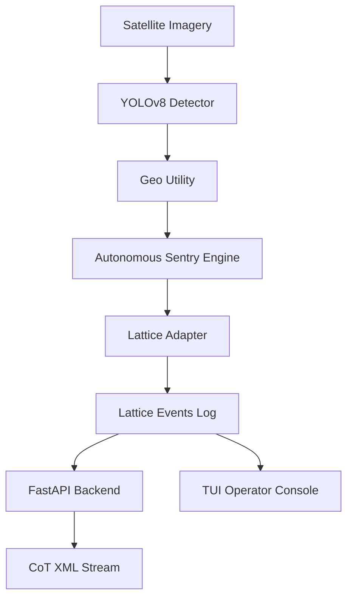

# Ghost Sentry: System Architecture

## Overview
Ghost Sentry is an automated ISR (Intelligence, Surveillance, and Reconnaissance) and Anomaly Detection pipeline designed for integration with the Anduril Lattice ecosystem. It focuses on processing geospatial optical imagery (Sentinel-2) to detect tactical assets and autonomously generate cueing tasks for confirmation.

## System Components

### 1. Detection Engine
- **Model**: YOLOv8n (Nano) fine-tuned on tactical targets.
- **Classes**: Airplane, Truck, Car, Boat, Bus.
- **Output**: Bounding boxes with confidence scores.

### 2. Geospatial Utility
- Converts pixel coordinates to Latitude/Longitude using CRS metadata (via Rasterio).
- Provides mock coordinate injection for demo scenarios.

### 3. Autonomous Sentry Engine
- Implements decision logic for the autonomous "kill-chain".
- **Trigger**: Confidence > 0.85 for high-priority targets (Airplane, Truck).
- **Action**: Publishes `VERIFICATION_REQUEST` tasks to Lattice.

### 4. Lattice Adapter
- Implements the "Adapter Pattern" for Lattice integration.
- Uses actual `anduril-lattice-sdk` (v4.0.0) data structures.
- Supports "Dev" mode (local logging) and "Prod" mode (Lattice Mesh integration).

### 5. Interoperability (CoT)
- Generates Cursor-on-Target (CoT) XML for tactical integration (ATAK/WinTAK).
- Exposes a REST endpoint for real-time CoT streaming.

### 6. Operator Console
- A Textual-based TUI for real-time monitoring.
- Allows operators to view detected tracks and generated tasks without a heavy web interface.

## Edge Deployment
Ghost Sentry is designed to be lightweight and containerized:
- **Footprint**: < 500MB including model weights.
- **Runtime**: Python 3.14+ (compatible with Pydantic V1/V2).
- **Optimization**: Optimized for NVIDIA Jetson and other edge hardware.
