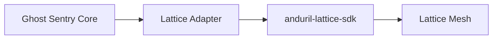

# Ghost Sentry: Lattice Integration Strategy

## Overview
Ghost Sentry is built to be "Lattice-native" by adopting the Lattice Data Schema (Entities, Tracks, Objects, Tasks) for its internal data models and providing an adapter layer compatible with the `anduril-lattice-sdk`.

## Integration Architecture

### 1. Data Models
Ghost Sentry uses Pydantic models in `lattice/entities.py` that mirror the official Lattice Protobuf schemas:
- **Track Entity**: Represents a detected object in space and time.
- **Task Entity**: Represents a request for action (e.g., verification).

### 2. The Adapter Pattern
The `LatticeConnector` in `lattice/adapter.py` abstracts the communication layer:
- **Dev Mode**: Writes events to `lattice_events.jsonl` for offline development and testing.
- **Prod Mode**: Interfaces with the gRPC-based Lattice Ingestion service.

### 3. Entity Mapping
| YOLO Class | Lattice Ontology | milView Disposition |
|------------|------------------|---------------------|
| airplane   | TEMPLATE_TRACK (Platform: Airplane) | UNKNOWN (default) |
| truck      | TEMPLATE_TRACK (Platform: Vehicle)  | UNKNOWN (default) |
| boat       | TEMPLATE_TRACK (Platform: Vessel)   | UNKNOWN (default) |

### 4. Autonomous Tasking
Ghost Sentry demonstrates "Lattice-ready" autonomous behavior by generating `VERIFICATION_REQUEST` tasks.
- **Trigger**: High-confidence detection of tactical assets.
- **Goal**: Autonomous cueing of secondary assets (sensors or platforms) for confirmation.
