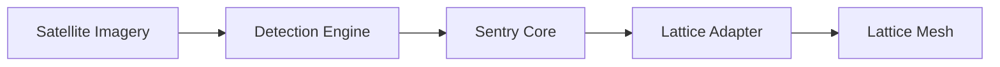

# Ghost Sentry

> **Automating the Edge for National Security.**

Ghost Sentry is an automated Intelligence, Surveillance, and Reconnaissance (ISR) pipeline designed to bridge the gap between passive observation and active mission tasking. It processes geospatial optical imagery (Sentinel-2) to detect tactical assets and autonomously generate cueing tasks for the Anduril Lattice ecosystem.

## Mission

In compliant environments, the volume of sensor data far exceeds human processing capacity. Ghost Sentry acts as an "Autonomous Sentry," seamlessly integrating with the **Lattice Mesh** to:
1.  **Monitor** vast areas of interest using commercial satellite imagery.
2.  **Detect** tactical assets (aircraft, vessels, vehicles) using edge-optimized AI.
3.  **Cue** high-fidelity assets for verification without human intervention.

## Key Capabilities

<CardGroup cols={2}>
  <Card title="Tactical AI" icon="crosshairs">
    YOLOv8-based detection of military and dual-use assets optimized for edge hardware.
  </Card>
  <Card title="Lattice Native" icon="network-wired">
    Built on the `anduril-lattice-sdk`, implementing standard Entity, Track, and Task schemas.
  </Card>
  <Card title="Autonomous Cueing" icon="robot">
    Logic engine that automatically generates `VERIFICATION_REQUEST` tasks for high-confidence targets.
  </Card>
  <Card title="Interoperability" icon="globe">
    Real-time Cursor-on-Target (CoT) streaming for ATAK/WinTAK integration.
  </Card>
  <Card title="Operational Console" icon="desktop">
    Web-based Common Operating Picture (COP) for real-time tracking, task management, and fleet status.
  </Card>
</CardGroup>

## System Overview

Ghost Sentry operates as a modular pipeline:

